# 共享小程序集合（童车-轮椅-陪护床等）

#### 介绍
共享小程序集合，可以运营一切IoT智能物联网锁的共享项目（如：共享童车、共享轮椅、共享陪护床、共享购物车、共享单车、共享景区车、智能售货柜）。已对接微信支付、微信信用分免押支付，已对接IoT物联网锁。

特别说明：满足以下应用场景和模式即可直接使用，只需要后台重新上传素材和数据即可（如：将轮椅换成陪护床），无需修改代码。

#### 软件架构
基于JeecgBoot开发，支持SpringBoot和SpringCloud随时切换部署，满足后期访问量大的需求！

#### 使用说明

1.  注册微信小程序并通过认证、开通微信支付、开通微信信用分免押支付；
2.  选择合适的一款IoT物联网智能锁（见下图）；
3.  开通云ECS服务器；
4.  安装宝塔面板，并配置域名、SSL证书、Nginx、MySQL、Redis等；
5.  启动后端服务；
6.  发布小程序和H5网页；

### IoT物联网智能锁

NB-IoT智能锁，一拖N，带锁头、RFID读头。

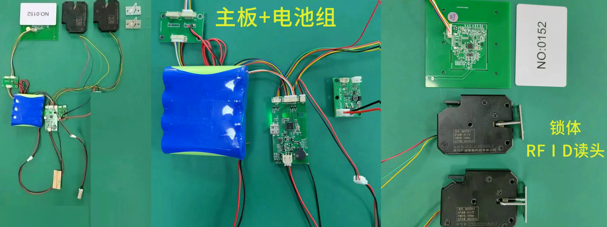

### 适用场景

满足以上条件的IoT物联网智能锁，都可以使用本共享小程序实现以下场景：

### 软件截图

#### 用户端

用户端为微信小程序端，请使用微信小程序打开，兼容Android、iOS。

功能清单：

- 1、手机号登录
- 2、首页
- 2.1、首页-登录用车
- 2.2、首页-扫一扫用车
- 2.3、首页-站点地图
- 2.4、首页-公告
- 2.5、首页-轮播图
- 2.6、扫码设备详情
- 2.7、押金租用
- 2.8、免押租用(微信信用分)
- 2.9、租借中订单(实时计费)
- 2.10、手动开锁(失败时)
- 2.11、手动结束(失败时)
- 3、使用说明
- 3.1、常见问题
- 3.2、操作视频
- 3.3、指引图片
- 4、个人中心
- 4.1、我的订单(列表、详情)
- 4.2、故障反馈
- 4.3、客服中心
- 4.4、我要加盟
- 4.5、关于我们
- 5、客服中心
- 5.1、使用说明
- 5.2、其他问题
- 5.3、在线客服
- 5.4、客服电话
- 6、附近站点
- 6.1、站点列表
- 6.2、站点地图
- 6.3、站点详情(营业时间、空闲设备等)
- 6.4、站点导航

部分功能截图展示：

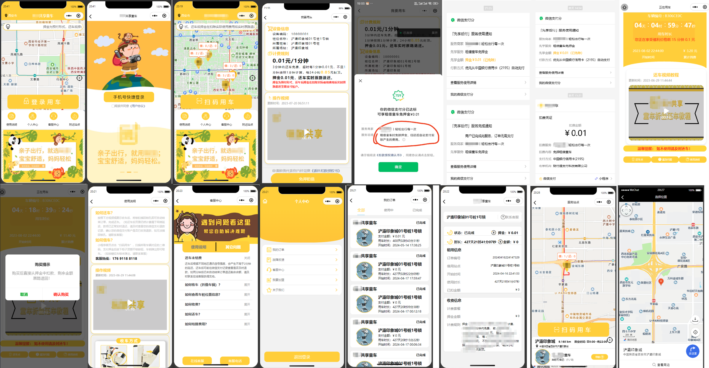

#### 商家端

商家端为公众号H5网页，请使用微信内置浏览器打开，兼容Android、iOS。

功能清单：

- 1、登录
- 1.1、账号密码登录
- 1.2、绑定微信登录
- 2、首页
- 2.1、轮播图
- 2.1、通知公告
- 2.2、订单统计(最近15天收益)
- 3、场站
- 3.1、场站列表
- 3.2、场站详情
- 4、订单
- 4.1、订单列表(支持搜索)
- 4.2、订单详情
- 5、钱包
- 5.1、钱包余额(可提现、余额、累计收益)
- 5.2、立即提现(后台设置提现规则)
- 5.3、提现记录
- 6、个人中心
- 6.1、账号信息(头像、用户名、手机号)
- 6.2、修改密码
- 6.3、绑定微信(绑定后可微信登录)
- 6.4、设置
- 6.5、退出

部分功能截图展示：`参考运维端截图展示`

#### 运维端

运维端为公众号H5网页，请使用微信内置浏览器打开，兼容Android、iOS。

- 1、登录
- 1.1、账号密码登录
- 1.2、绑定微信登录
- 2、首页
- 2.1、轮播图
- 2.1、通知公告
- 2.2、订单统计(最近15天收益)
- 3、场站
- 3.1、场站列表
- 3.2、场站详情(空闲/使用车辆数、电量、信号、商家分成比例等)
- 3.3、设备管理(远程开锁)
- 4、订单
- 4.1、订单列表(支持搜索)
- 4.2、订单详情
- 4.3、订单管理(远程开锁、远程结束、修改金额、退款等)
- 5、钱包(运维端钱包为不可提现)
- 6、个人中心
- 6.1、账号信息(头像、用户名、手机号)
- 6.2、修改密码
- 6.3、绑定微信(绑定后可微信登录)
- 6.4、设置
- 6.5、退出

部分功能截图展示：

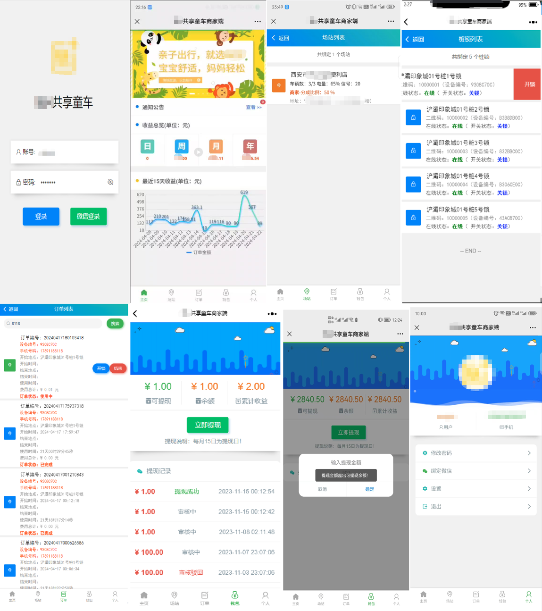

#### 后台运营管理端

后台运营管理端为PC端，使用Chrome、Edge等浏览器访问。

功能清单：

- 1、登录
- 2、平台首页
- 3、个人中心
- 4、共享童车
- 4.1、微信用户
- 4.2、服务场站
- 4.3、港区/车桩
- 4.4、港口/桩位
- 4.5、设备/车辆
- 4.6、使用说明
- 4.7、故障上报
- 4.8、加盟申请
- 4.9、计费套餐包
- 4.10、订单信息
- 4.11、订单管理
- 4.12、使用记录
- 4.13、用户账户
- 4.14、商家账户
- 4.15、代理商设置
- 4.16、商户提现记录
- 4.17、首页轮播图
- 4.18、消息提示
- 4.19、常见问题
- 4.20、参数设置
- 4.21、素材管理
- 5、统计管理
- 5.1、收益汇总统计
- 5.2、每日销售统计
- 5.3、站点每日统计
- 5.4、部门每日统计
- 6、系统管理
- 6.1、用户管理
- 6.2、角色管理
- 6.3、菜单管理
- 6.4、部门管理
- 6.5、我的部门
- 6.6、字典管理
- 6.7、通讯录
- 6.8、系统通告

##### 1、登录

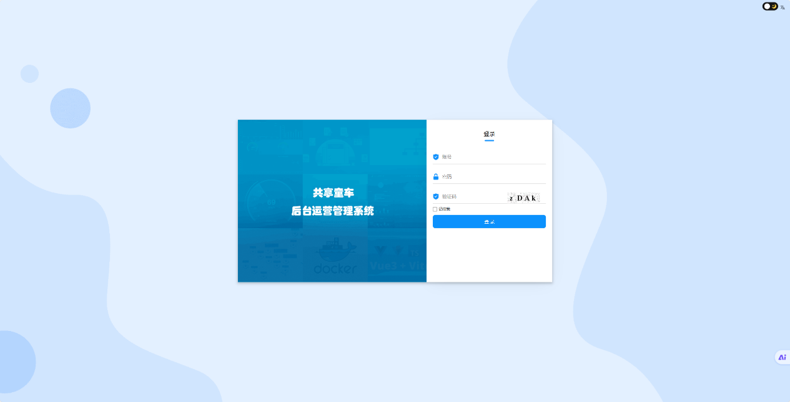

##### 2、平台首页

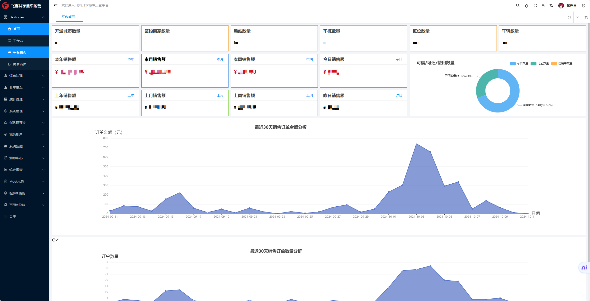

##### 3、个人中心

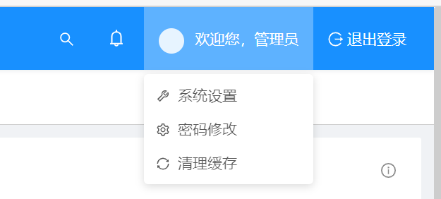

##### 4、共享童车
###### 4.1、微信用户

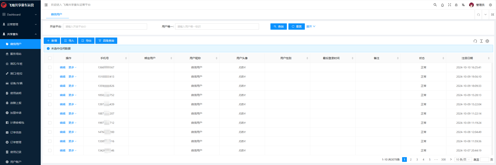

###### 4.2、服务场站

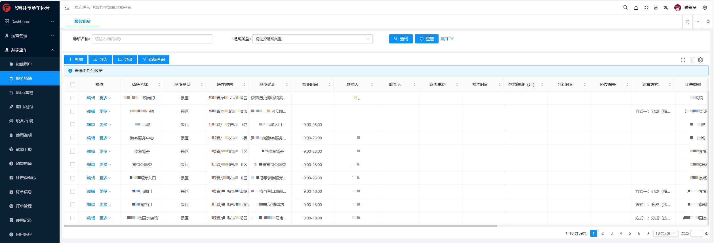

###### 4.3、港区/车桩

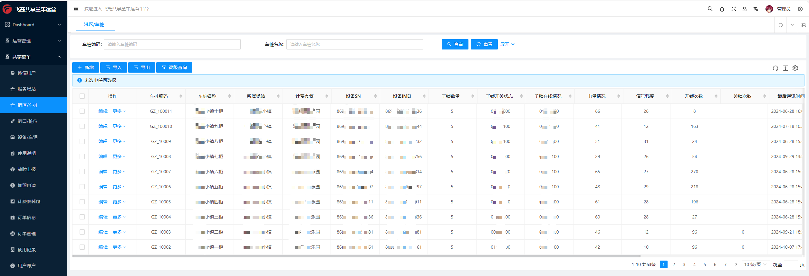

###### 4.4、港口/桩位

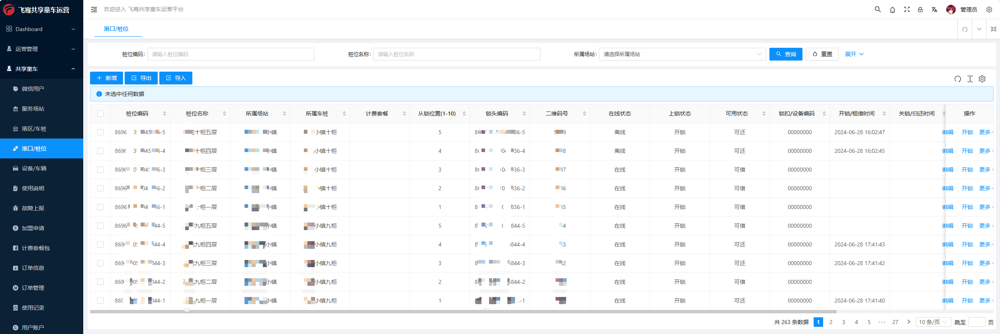

###### 4.5、设备/车辆

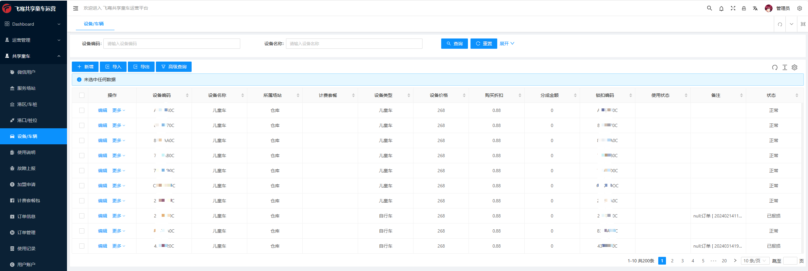

###### 4.6、使用说明

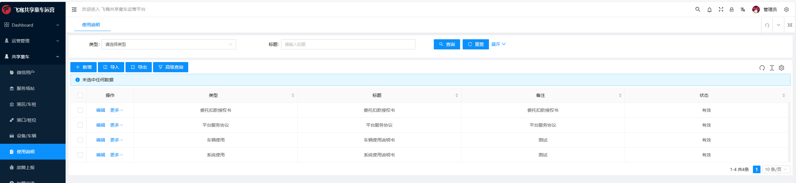

###### 4.7、故障上报

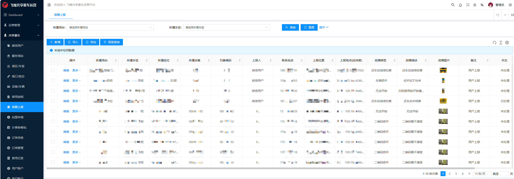

###### 4.8、加盟申请

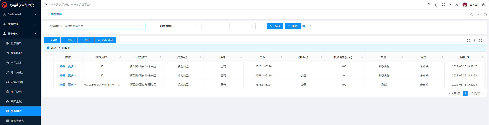

###### 4.9、计费套餐包

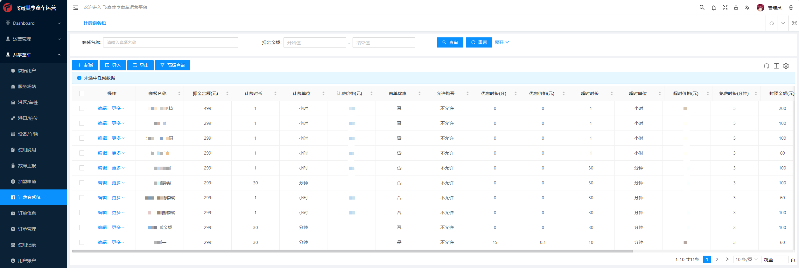

###### 4.10、订单信息

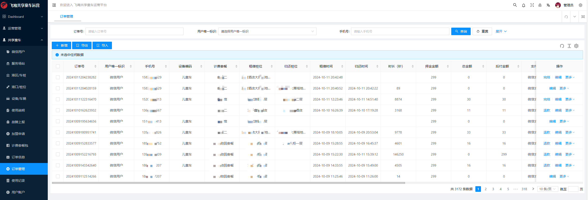

###### 4.11、订单管理

###### 4.12、使用记录

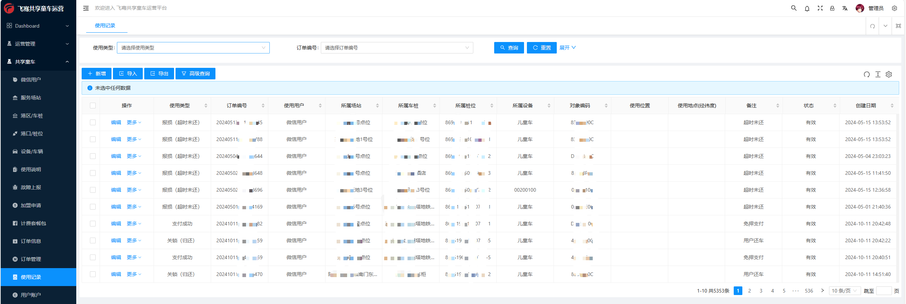

###### 4.13、用户账户

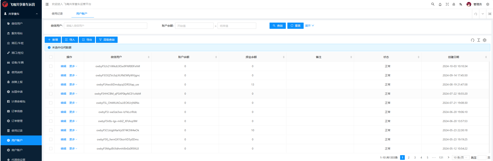

###### 4.14、商家账户

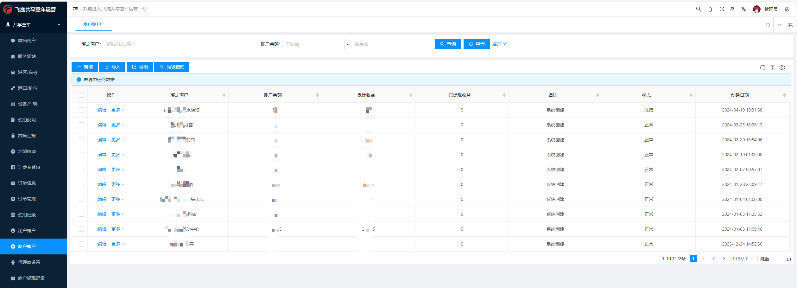

###### 4.15、代理商设置

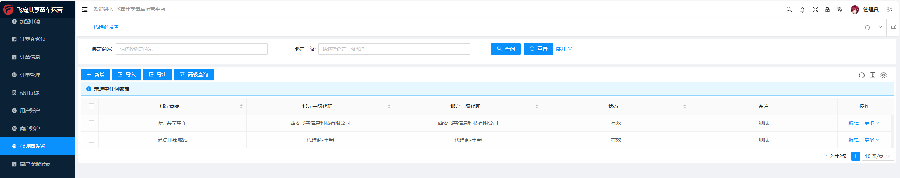

###### 4.16、商户提现记录

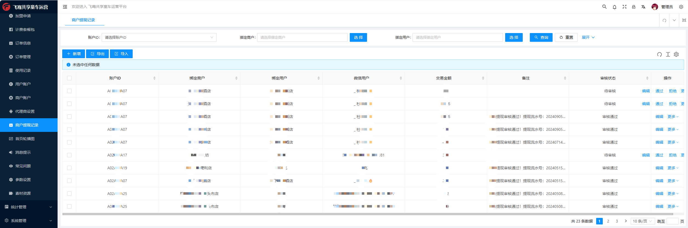

###### 4.17、首页轮播图

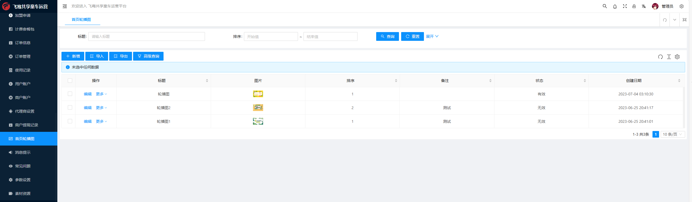

###### 4.18、消息提示

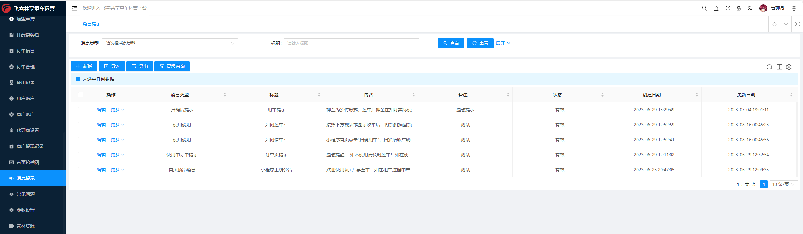

###### 4.19、常见问题

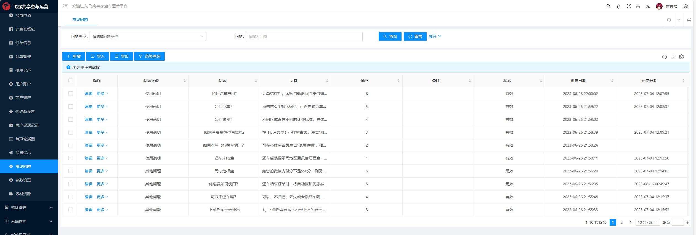

###### 4.20、参数设置

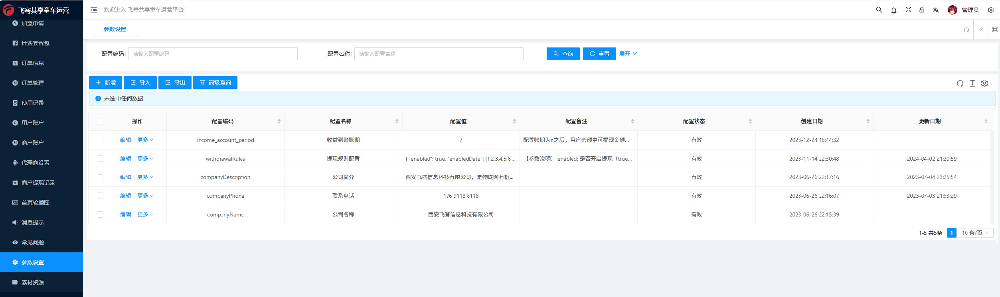

###### 4.21、素材管理

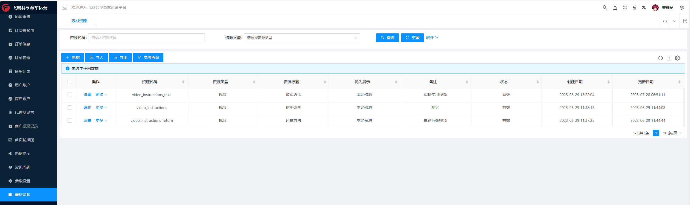

##### 5、统计管理
##### 5.1、收益汇总统计

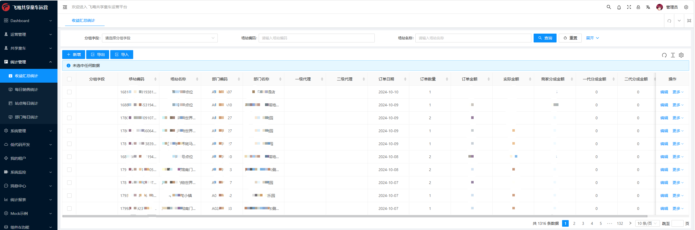

##### 5.2、每日销售统计

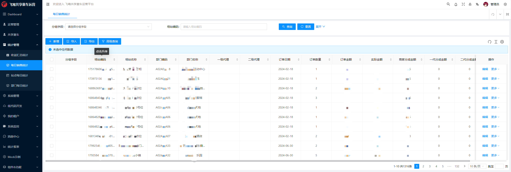

##### 5.3、站点每日统计

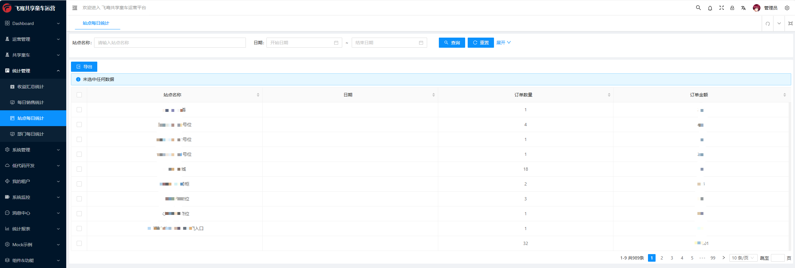

##### 5.4、部门每日统计

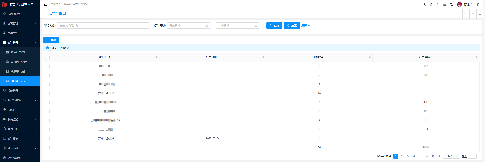

##### 6、系统管理

系统管理所有功能参考JeecgBoot官网展示的系统管理模块，功能如下：

- 6.1、用户管理
- 6.2、角色管理
- 6.3、菜单管理
- 6.4、部门管理
- 6.5、我的部门
- 6.6、字典管理
- 6.7、通讯录
- 6.8、系统通告

### 定制开发/商用授权/商业合作

